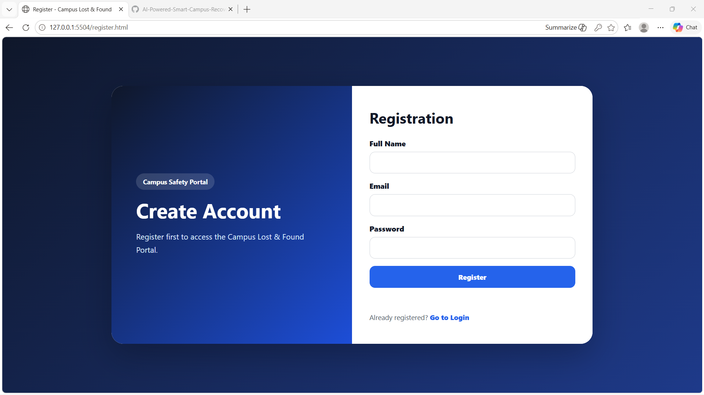
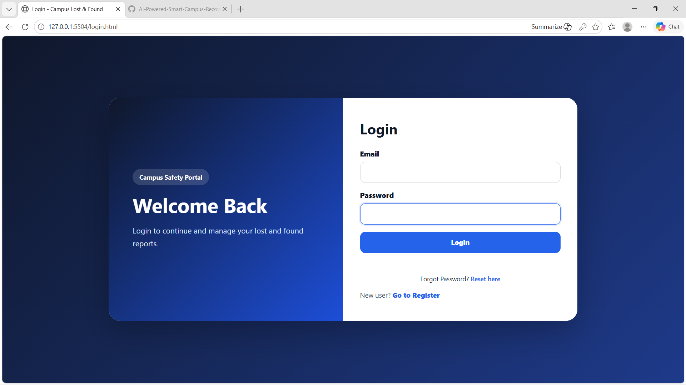
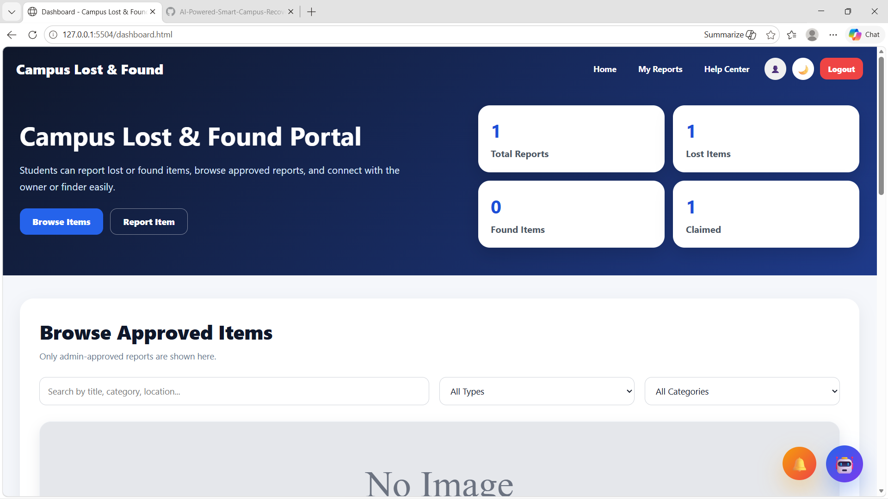
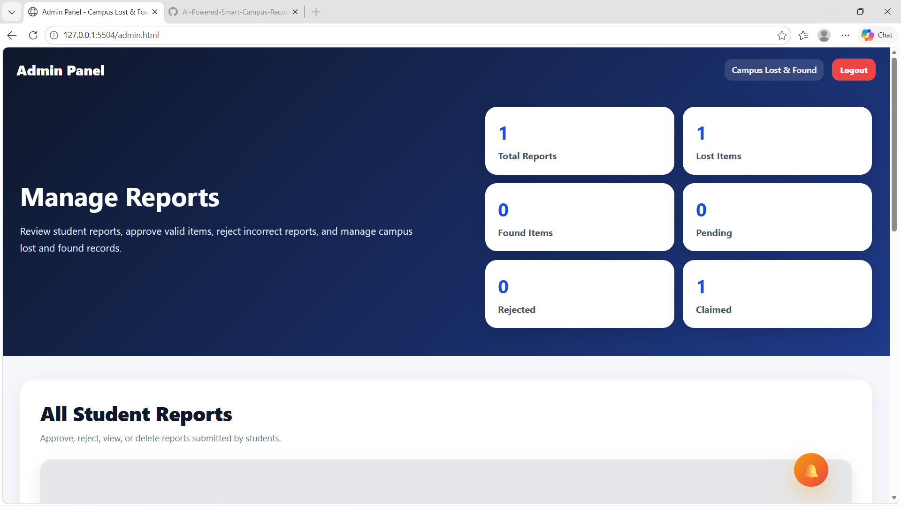
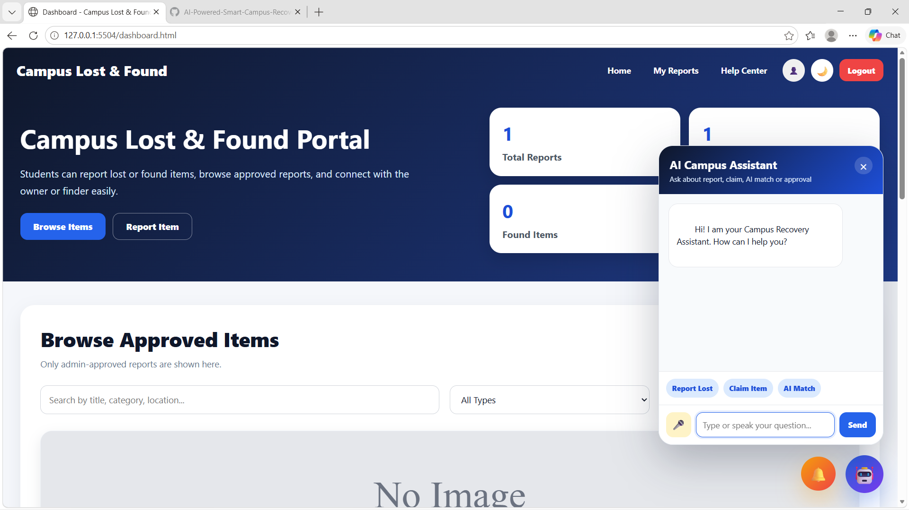

# 🚀 AI-Powered Smart Campus Recovery System

An intelligent AI-based Lost & Found platform designed for colleges and universities to help students recover lost items quickly, securely, and efficiently.

---

# 📌 Problem Statement

Students frequently lose important belongings such as ID cards, wallets, gadgets, documents, keys, and accessories on campus. Traditional lost-and-found systems are usually manual, slow, unorganized, and insecure. There is no smart realtime tracking or intelligent matching system to connect lost items with found reports.

To solve this issue, we developed an AI-Powered Smart Campus Recovery System that uses AI Smart Matching, realtime notifications, secure claim verification, admin approval workflows, and an AI chatbot assistant to improve recovery rates and reduce fake claims.

---

# ✨ Key Features

## 🔐 Authentication System
- Student registration/login
- Admin login
- JWT authentication
- Secure session handling

---

## 📦 Lost & Found Reports
- Report lost items
- Report found items
- Upload item images
- Category & location support

---

## 🤖 AI Smart Match System
- AI-based item matching
- Detects similar lost/found reports
- Match popup with score
- Smart recovery suggestions

---

## 💬 AI Campus Assistant
- Real AI chatbot using Groq API
- Voice assistant support
- Typing animation
- Smart guidance for students

---

## 🔔 Realtime Notifications
- Notification bell system
- Realtime alerts
- Notification sound
- Claim approval updates

---

## 🛡️ Claim Verification System
- Secure claim requests
- Admin approval/rejection
- Prevents fake claims
- Claim tracking system

---

## 📧 Email Notification System
- Claim approval emails
- Report updates
- Realtime communication

---

## 🌙 Modern UI/UX
- Dark mode support
- Responsive design
- Premium dashboard
- Interactive animations

---

# 🧠 AI Integration

This project integrates Artificial Intelligence to improve item recovery efficiency:

- AI Smart Match
- AI Chatbot Assistant
- Intelligent matching logic
- Smart recovery recommendations

---

# 🛠️ Tech Stack

## Frontend
- HTML
- CSS
- JavaScript

## Backend
- Node.js
- Express.js

## Database
- MongoDB Atlas

## AI
- Groq API
- Llama 3.3 70B Model

## Other Tools
- JWT Authentication
- Nodemailer
- Socket.io
- Cloud APIs

---

# 📸 Project Screenshots

## 📝 Registration Page



## 🔑 Login Page


---


---

## 🏠 Student Dashboard


---

## ⚙️ Admin Panel


---

## 🤖 AI Chatbot Assistant


---

# 🔄 System Workflow

Student → Report Item → AI Smart Match → Claim Request → Admin Verification → Notification & Email → Item Recovery

---

# 🚀 Future Enhancements

- AI Fraud Detection
- Semantic AI Search
- AI Face/Object Recognition
- QR-Based Recovery
- Mobile Application
- Smart CCTV Integration
- Blockchain Verification
- Cloudinary Image Uploads

---

# 📂 Installation Guide

## Clone Repository

```bash
git clone https://github.com/abhay-singh-bisht12/AI-Powered-Smart-Campus-Recovery-System.git
